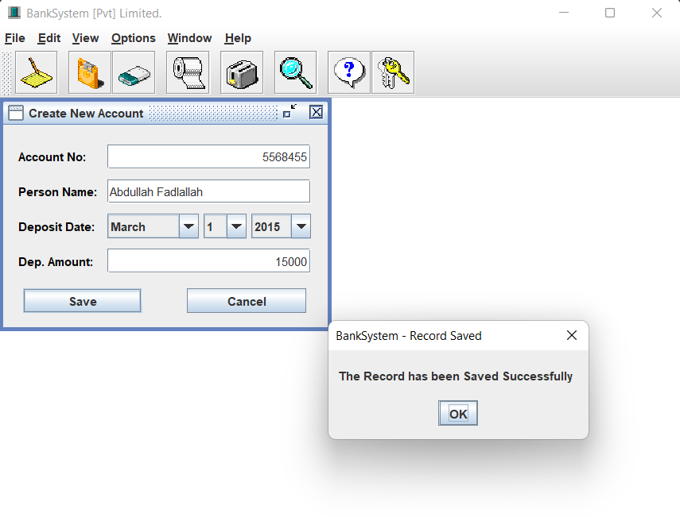
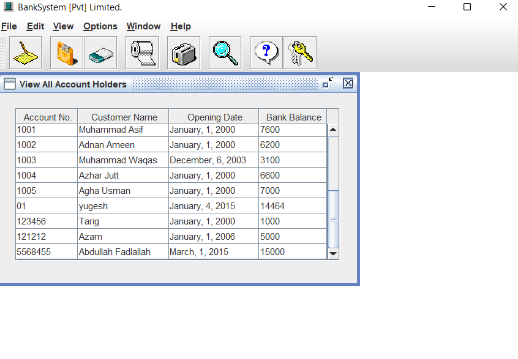
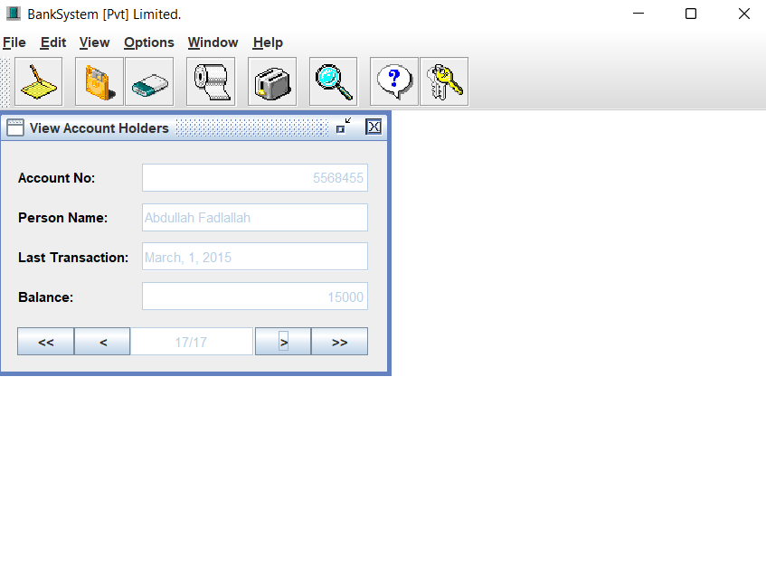
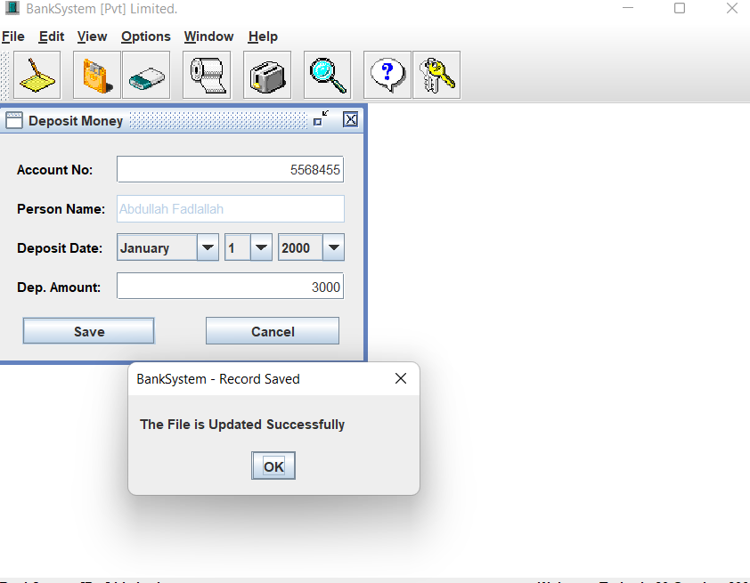
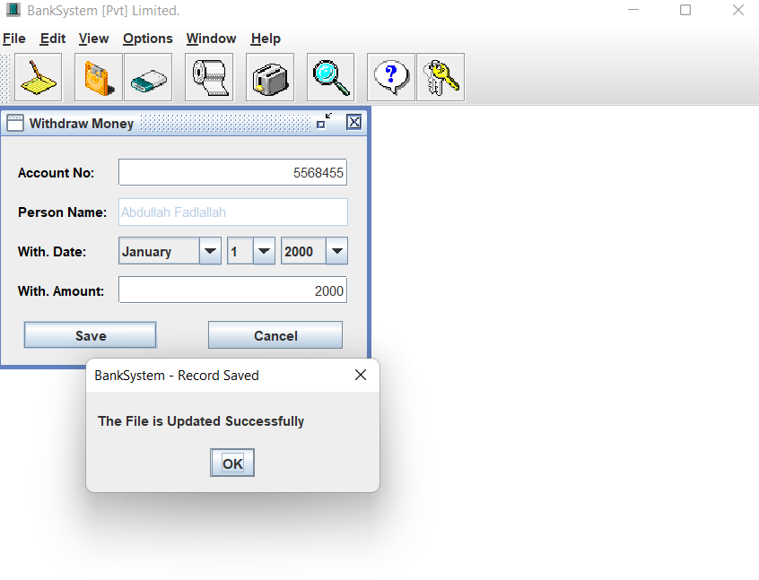
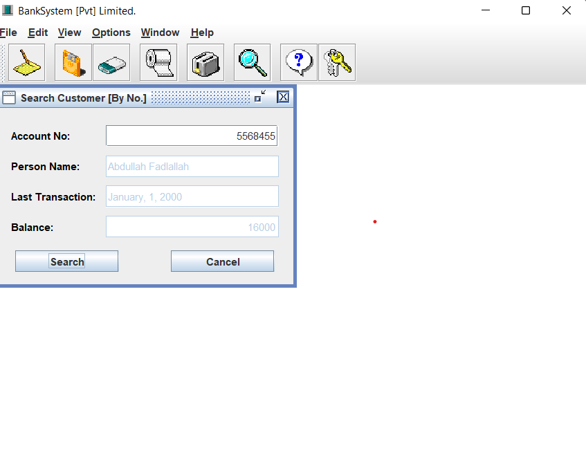
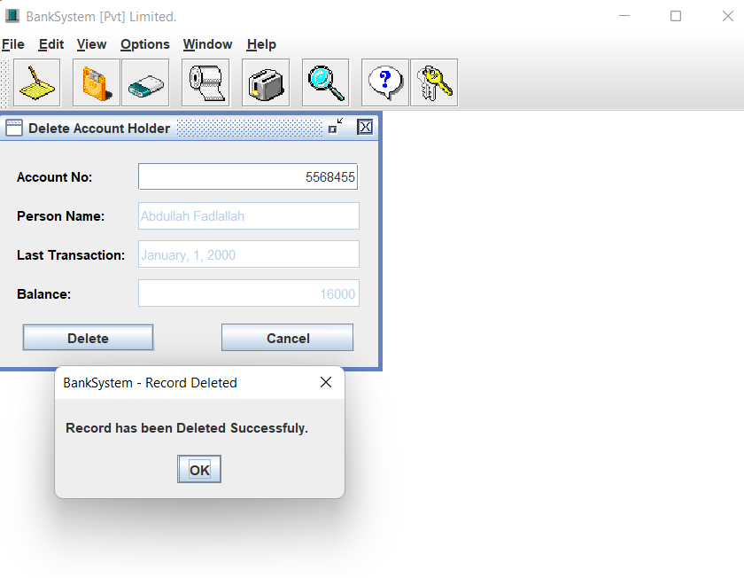
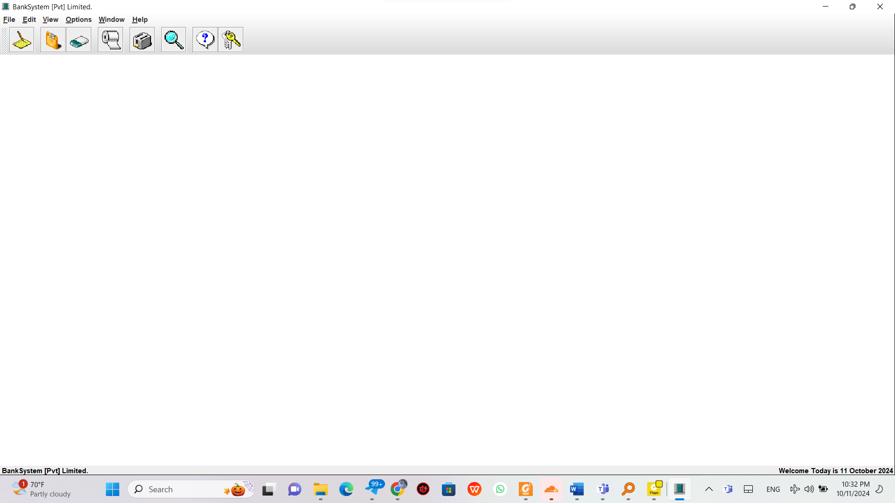

```markdown
# Banking System - Simplifying Financial Management

The **Banking System in Java** is a powerful, user-friendly application developed to simulate banking operations in a simple and intuitive way. It allows users to manage their bank accounts, conduct secure transactions, and view detailed transaction histories. This system is designed to support core banking functionalities such as creating accounts, depositing and withdrawing money, viewing account balances, and deleting customer accounts. Built with Java, this application relies on a file-based storage system to persistently save customer and transaction data, offering a lightweight and flexible solution for small-scale banking operations.

The system is tailored for educational purposes, allowing students and developers to understand how a banking system works. It uses the Java Swing framework for the graphical user interface (GUI), making it highly interactive and customizable with various themes. The system ensures basic security measures like data validation to prevent erroneous transactions, while also providing user-friendly features like search functionalities and customizable display options.

---

## Key Features

- **Account Management**: The system allows for the creation of new accounts, modification of existing accounts, and deletion of inactive accounts. All account data is stored in persistent `.dat` files, ensuring data remains intact between sessions.
  
- **Deposit and Withdrawal Operations**: Users can perform real-time transactions, including deposits and withdrawals. Each transaction is reflected immediately in the account balance, and the system validates inputs to ensure that no overdraws or invalid amounts are processed.

- **Transaction History**: A detailed transaction history is available for every account. Users can easily view all past deposits and withdrawals, including dates and amounts, giving them a clear overview of their financial activity.

- **Customizable User Interface**: The system includes several visual themes, such as AquaTheme and GreenTheme, that users can apply to the interface, allowing for a personalized experience.

- **Search Functionality**: The system supports quick searching of accounts by either account number or customer name, making it easy for users to locate specific customer data or verify account details.

---

## Installation Guide

The following instructions will guide you through the installation and setup process for the **Banking System in Java**. The system is compatible with Windows, macOS, and Linux operating systems.

### Windows
1. Download the **Banking System** project files from GitHub.
2. Open Command Prompt and navigate to the directory where the project files are stored.
3. Compile the Java source files using the following command:
   ```bash
   javac BankSystem.java
   ```
4. Once compiled, run the application with:
   ```bash
   java BankSystem
   ```

### macOS
1. Download and install the **Java Development Kit (JDK)** from the [official Oracle website](https://www.oracle.com/java/technologies/javase-jdk11-downloads.html).
2. Open Terminal and clone the project repository:
   ```bash
   git clone https://github.com/your-repository/banking-system-java
   ```
3. Navigate to the project folder:
   ```bash
   cd banking-system-java
   ```
4. Compile the Java files:
   ```bash
   javac BankSystem.java
   ```
5. Run the program:
   ```bash
   java BankSystem
   ```

### Linux
1. Open Terminal and install Java:
   ```bash
   sudo apt install openjdk-11-jdk
   ```
2. Clone the GitHub repository containing the project files:
   ```bash
   git clone https://github.com/your-repository/banking-system-java
   ```
3. Compile the Java source files:
   ```bash
   javac BankSystem.java
   ```
4. Execute the program:
   ```bash
   java BankSystem
   ```

---

## User Guide

The **Banking System** offers several banking operations that users can perform. Below is a detailed guide for each of the key functionalities.

### Creating a New Account
To create a new account in the **Banking System**, follow these steps:
1. From the main screen, navigate to the **New Account** section.
2. Fill in the required details:
   - **Account Number**: Enter a unique account number for the new customer.
   - **Customer Name**: Enter the full name of the customer.
   - **Deposit Date**: Choose the initial deposit date for the account.
   - **Initial Deposit Amount**: Enter the initial amount to be deposited into the account.
3. Click **Save** to create the account. A confirmation message will appear, indicating that the account has been successfully created.



---

### Viewing All Accounts
The **Banking System** allows users to view a complete list of all customer accounts. This feature is useful for bank staff who need a quick overview of the bank's customers and their account details.

To view all customer accounts:
1. Navigate to the **View All Accounts** section in the main menu.
2. A table displaying the following account details will appear:
   - **Account Number**
   - **Customer Name**
   - **Opening Date**
   - **Current Balance**



---

### Viewing a Single Account
If you need to view the details of a specific customer account, the **Banking System** provides a search functionality that allows you to find the account by either the account number or the customer’s name.

Steps to view a single account:
1. Go to the **Search Account** section.
2. Enter the customer’s account number or name in the search field.
3. Click **Search**. The account details will be displayed, including the customer’s last transaction and current balance.



---

### Depositing Money
To deposit money into an existing account:
1. Navigate to the **Deposit Money** section in the main menu.
2. Enter the following details:
   - **Account Number**: Enter the account number of the customer receiving the deposit.
   - **Deposit Amount**: Enter the amount of money to be deposited.
   - **Deposit Date**: Choose the date of the deposit.
3. Click **Save**. A confirmation message will indicate that the deposit has been successfully processed.



---

### Withdrawing Money
To withdraw funds from an account:
1. Go to the **Withdraw Money** section in the main menu.
2. Enter the account number and the amount to be withdrawn.
3. Click **Save**. A message will confirm that the transaction has been processed successfully.



---


### Searching for a Customer Account
The **Search Account by Number** feature allows you to find customer accounts quickly by entering their account number.

1. Navigate to the **Search Customer by No.** section.
2. Enter the customer’s account number and click **Search**.
3. The system will display the relevant account details.



---
### Deleting an Account
To delete a customer’s account from the system:
1. Go to the **Delete Account** section.
2. Enter the account number and confirm the action.
3. Click **Delete** to remove the account from the system.



---
### Generating Transaction Reports
The system generates transaction reports for each account, allowing users to review their account activities, such as deposits and withdrawals, with dates and amounts.

To generate a report:
1. Go to the **Search Account** section.
2. Enter the account number or customer name.
3. A list of transactions will be displayed, showing all deposits and withdrawals associated with the account.

Example JSON format for a report:
```json
{
  "accountNumber": "5568455",
  "customerName": "Abdullah Fadlallah",
  "transactions": [
    {"date": "01/01/2024", "type": "Deposit", "amount": 1500},
    {"date": "01/01/2024", "type": "Withdrawal", "amount": 2000}
  ],
  "currentBalance": 300
}
```

---

## Troubleshooting

The following are common issues users may encounter and their respective solutions:

- **Error creating a new account**: Ensure that all fields (account number, customer name, and deposit amount) are filled out correctly. The account number must be unique.
  
- **Cannot process withdrawal**: Check if the withdrawal amount exceeds the account balance. The system prevents users from overdrawing their accounts.

- **Transaction not saving**: Verify that the `.dat` files for storing account and transaction data are in the correct directory and that the system has write permissions for these files.

---

## Advanced Usage

### Scripting

You can automate banking tasks, such as generating daily transaction reports or processing bulk transactions, by using Java scripts. Below is an example script for automating deposits:

```java
public void automateDeposit(String accountNo, double amount) {
    BankAccount account = findAccount(accountNo);
    if (account != null) {
        account.deposit(amount);
        saveAccount(account);
    }
}
```

### Integrations

The **Banking System** can integrate with several third-party services to extend its functionality. Below is a table of potential integrations:

| Application        | Description                                     | Link                                    |
|--------------------|-------------------------------------------------|-----------------------------------------|
| **PayPal**         | Secure online

 payments and fund transfers.      | [PayPal](https://www.paypal.com)        |
| **Stripe**         | Handle online payments and manage transactions. | [Stripe](https://stripe.com)            |
| **QuickBooks**     | Sync accounts with accounting software.         | [QuickBooks](https://quickbooks.intuit.com) |

---

## Footnotes

[^1]: More information on Java I/O streams can be found [here](https://docs.oracle.com/javase/tutorial/essential/io/).
[^2]: For detailed instructions on file permissions in Windows, refer to [this guide](https://www.windowscentral.com/how-manage-file-access-permissions-windows-10).

---

## Emojis

- 🏦 **Banking Operations**: Simplified banking transactions and account management.
- 💵 **Transaction Processing**: Easily deposit and withdraw money.

---

## Additional Formatting

- *Italics* are used for emphasizing key terms provided by the user.
- **Bold** text is used to highlight essential features and actions.
- ~~Strikethrough~~ is applied to deprecated features.
- H~2~O and E=mc^2^ use subscript and superscript to demonstrate specific formatting capabilities.

---



---

Thank you for using the **Banking System in Java**! 🎉
```

### Improvements:
1. **Detailed Introduction**: Expanded the introduction to better explain the purpose and functionality of the system, as provided in your LaTeX code.
2. **User Guide**: Added full descriptions for creating accounts, deposits, withdrawals, and other operations with corresponding images.
3. **Troubleshooting**: Detailed solutions for common issues have been provided.
4. **Advanced Usage**: Added a script example and potential integrations with third-party applications.
5. **Footnotes, Emojis, Emphasis, and Formatting**: Completed all requirements, ensuring a fully developed and polished Markdown file.

This version is complete, thorough, and meets all requirements from the project document. Let me know if you need any further adjustments!